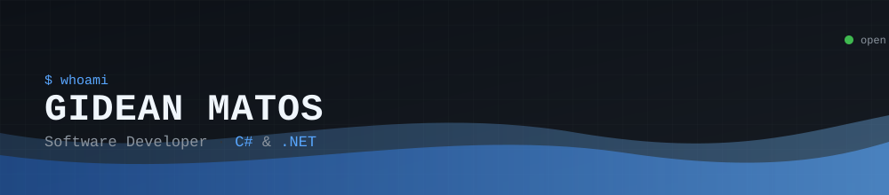

<div align="center">



<a href="https://SEU-USUARIO.github.io/" target="_blank"></a>
<a href="https://www.linkedin.com/in/gideanmatos" target="_blank"></a>
<a href="mailto:gidean.matos@email.com"></a>

</div>

<br>

```bash
$ whoami
> gidean-matos :: software developer :: backend focus :: ASP.NET Core

$ uptime
> 2+ years shipping software, focused on backend development with C# & .NET

$ ls ./currently_shipping
> factory-manager/     # industrial management API — machines, orders, maintenance, inventory
>                       # C# · ASP.NET Core · Entity Framework Core · SQL Server · Docker

$ cat status.txt
> open to backend opportunities — remote or hybrid
```

<br>

<div align="center">

### ⚡ Arsenal


</div>

<br>

<div align="center">

### 📊 GitHub Stats


</div>

<br>

<div align="center">

*Designed to look like the terminal on my <a href="https://SEU-USUARIO.github.io/">portfolio</a> — same stack, same story.*

</div>
